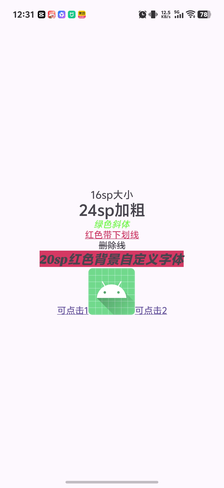

# Spanny - Android 富文本构建库

一个基于Kotlin DSL的Android富文本构建库，支持通过链式调用快速构建包含样式、交互和图片的复杂文本内容。

## 效果预览

以下是使用本库构建的富文本示例效果（实际效果以运行时为准）：


*注：图片展示了包含不同字体大小、颜色、样式（粗体/斜体）、下划线、删除线、自定义字体、可点击文本及插入图片的综合效果*

## 功能特性
- **丰富的样式支持**：字体颜色、背景色、粗体、斜体、下划线、删除线、自定义字体、字体大小

## API 参考
以下是`DslSpanBuilder`接口支持的核心方法：

| 方法名                  | 参数说明                                                                 | 功能描述                                   |
|-------------------------|--------------------------------------------------------------------------|-------------------------------------------|
| `textColor(@ColorInt color)` | `color`: 颜色值（支持`0xFFE91E63`格式或`"#00FF00".toColorInt()`转换） | 设置字体前景色                             |
| `backgroundColor(@ColorInt color)` | `color`: 颜色值                                                          | 设置字体背景色                             |
| `textSize(size: Int)`     | `size`: 字体大小（单位：sp）                                              | 设置字体大小                               |
| `click(block: (View) -> Unit)` | `block`: 点击事件回调（接收点击的View参数）                              | 设置可点击文本的点击事件                   |
| `bold()`                 | 无                                                                       | 应用粗体样式                               |
| `italic()`               | 无                                                                       | 应用斜体样式                               |
| `underline()`            | 无                                                                       | 添加下划线                                 |
| `strikethrough()`        | 无                                                                       | 添加删除线                                 |
| `fontFamily(typeface: Typeface)` | `typeface`: 自定义字体（通过`ResourcesCompat.getFont`加载）              | 应用自定义字体（需提前将字体文件放入`res/font`目录） |
- **交互能力**：支持文本区域点击事件（点击后触发Toast或自定义逻辑）
- **图片插入**：支持通过资源ID或Bitmap插入图片到文本中
- **DSL链式调用**：通过简洁的Kotlin DSL语法构建富文本，代码可读性强
- **灵活扩展**：支持自定义Span类型扩展（如新增上标/下标样式）

## 安装
在项目的`build.gradle.kts`中添加依赖：
```kotlin
    implementation(project(":library"))
```

## 快速开始
### 基础用法
在`Activity`或`Fragment`中通过DSL构建富文本：
```kotlin
findViewById<TextView>(R.id.tv_demo).buildDslSpannableString {
    addText("16sp大小") { textSize(16) }
    addText("\n24sp加粗") { textSize(24).bold() }
    addText("\n绿色斜体") { textColor("#00FF00".toColorInt()).italic() }
    addText("\n红色带下划线") { textColor(0xFFE91E63.toInt()).underline() }
    addText("\n删除线") { strikethrough() }
    // 自定义字体示例（需提前将字体文件放入res/font目录）
    val customTypeface = ResourcesCompat.getFont(this@MainActivity, R.font.sansita_extra_bold_italic)
    addText("\n20sp红色背景自定义字体") { fontFamily(customTypeface!!).textSize(20).backgroundColor(0xFFE91E63.toInt()) }
    // 可点击文本
    addText("\n可点击文本") { click { showToast("点击事件触发") } }
    // 插入图片
    addImage(this@MainActivity, R.mipmap.ic_launcher)
}
```

### 关键类说明
| 类名                  | 功能描述                                   |
|-----------------------|-------------------------------------------|
| `DslSpanBuilder`       | 定义样式操作接口（textColor、bold等方法） |
| `DslSpanBuilderImpl`   | 样式操作的具体实现类                      |
| `DslSpannableStringBuilder` | 富文本构建主接口（addText、addImage方法） |
| `DslSpannableStringBuildImpl` | 富文本构建的具体实现类                    |

## 扩展开发
如需新增自定义Span类型（如添加阴影效果）：
1. 在`DslSpanBuilder`接口中添加新方法（如`shadow(radius: Float, dx: Float, dy: Float, color: Int)`）
2. 在`DslSpanBuilderImpl`中实现该方法，将`ShadowSpan`添加到Span集合
3. 在业务代码中通过DSL调用新方法

## 贡献
欢迎提交Issue反馈问题或提交PR参与开发：
1. Fork本仓库
2. 创建特性分支（`git checkout -b feature/xxx`）
3. 提交代码（`git commit -am 'Add xxx feature'`）
4. 推送分支（`git push origin feature/xxx`）
5. 提交Pull Request

## 许可证
[MIT License](LICENSE)